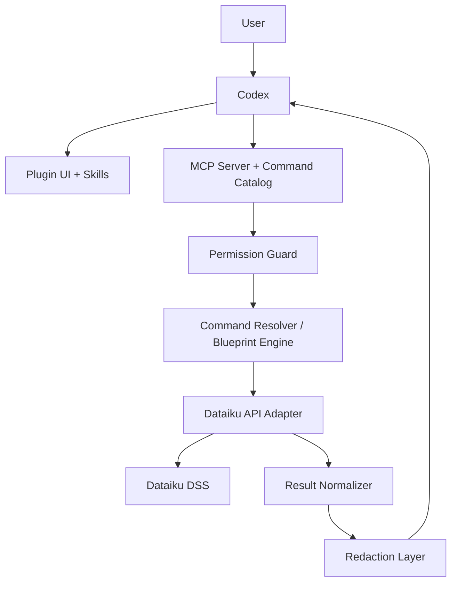
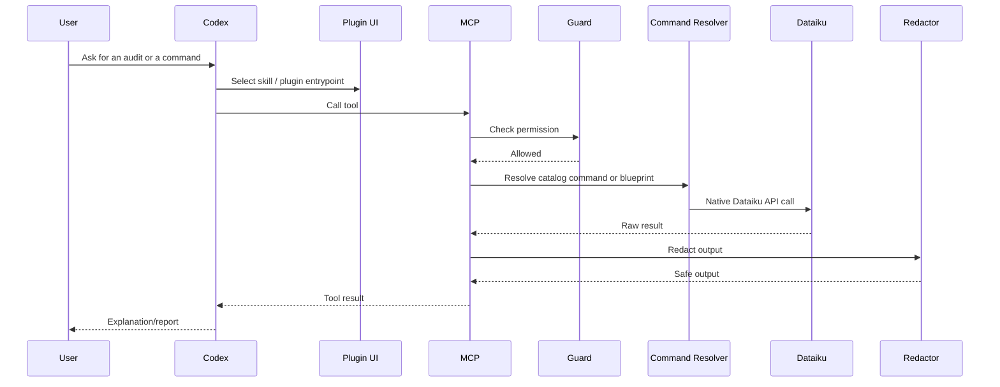
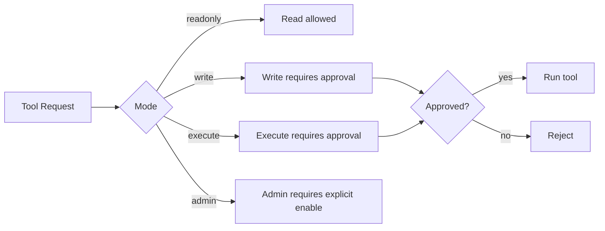
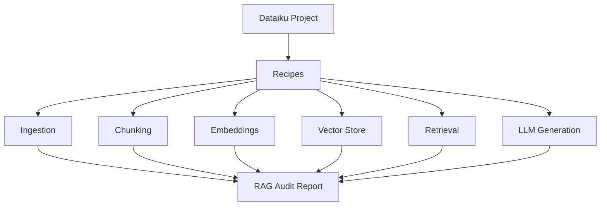
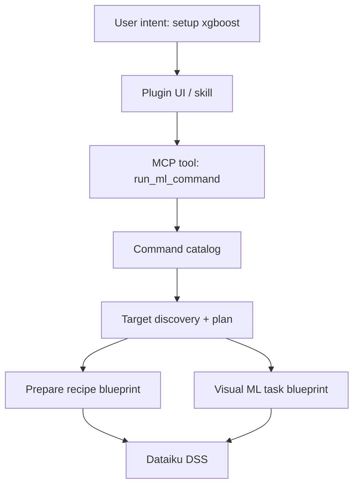

# Architecture Diagrams

## High-level architecture

```mermaid
flowchart TD
    U[User] --> C[Codex]
    C --> UI["Plugin UI + Skills"]
    C --> MCP["MCP Server + Command Catalog"]
    MCP --> P[Permission Guard]
    P --> R1["Command Resolver / Blueprint Engine"]
    R1 --> A[Dataiku API Adapter]
    A --> DSS[Dataiku DSS]
    A --> R[Result Normalizer]
    R --> X[Redaction Layer]
    X --> C
```

## Tool call flow

```mermaid
sequenceDiagram
    participant User
    participant Codex
    participant UI as Plugin UI
    participant MCP
    participant Guard
    participant Resolver as Command Resolver
    participant Dataiku
    participant Redactor

    User->>Codex: Ask for an audit or a command
    Codex->>UI: Select skill / plugin entrypoint
    Codex->>MCP: Call tool
    MCP->>Guard: Check permission
    Guard-->>MCP: Allowed
    MCP->>Resolver: Resolve catalog command or blueprint
    Resolver->>Dataiku: Native Dataiku API call
    Dataiku-->>MCP: Raw result
    MCP->>Redactor: Redact output
    Redactor-->>MCP: Safe output
    MCP-->>Codex: Tool result
    Codex-->>User: Explanation/report
```

## Permission model

```mermaid
flowchart LR
    Tool[Tool Request] --> Mode{Mode}
    Mode -->|readonly| Read[Read allowed]
    Mode -->|write| Write[Write requires approval]
    Mode -->|execute| Exec[Execute requires approval]
    Mode -->|admin| Admin[Admin requires explicit enable]
    Write --> Approval{Approved?}
    Exec --> Approval
    Approval -->|yes| Run[Run tool]
    Approval -->|no| Reject[Reject]
```

## RAG audit workflow

```mermaid
flowchart TD
    Project[Dataiku Project] --> Recipes[Recipes]
    Recipes --> Ingestion[Ingestion]
    Recipes --> Chunking[Chunking]
    Recipes --> Embeddings[Embeddings]
    Recipes --> VectorStore[Vector Store]
    Recipes --> Retrieval[Retrieval]
    Recipes --> Generation[LLM Generation]
    Ingestion --> Audit[RAG Audit Report]
    Chunking --> Audit
    Embeddings --> Audit
    VectorStore --> Audit
    Retrieval --> Audit
    Generation --> Audit
```

## ML command workflow

```mermaid
flowchart TD
    User["User intent: setup xgboost"] --> Plugin["Plugin UI / skill"]
    Plugin --> MCP["MCP tool: run_ml_command"]
    MCP --> Catalog["Command catalog"]
    Catalog --> Planner["Target discovery + plan"]
    Planner --> Prepare["Prepare recipe blueprint"]
    Planner --> VisualML["Visual ML task blueprint"]
    Prepare --> DSS["Dataiku DSS"]
    VisualML --> DSS
```
